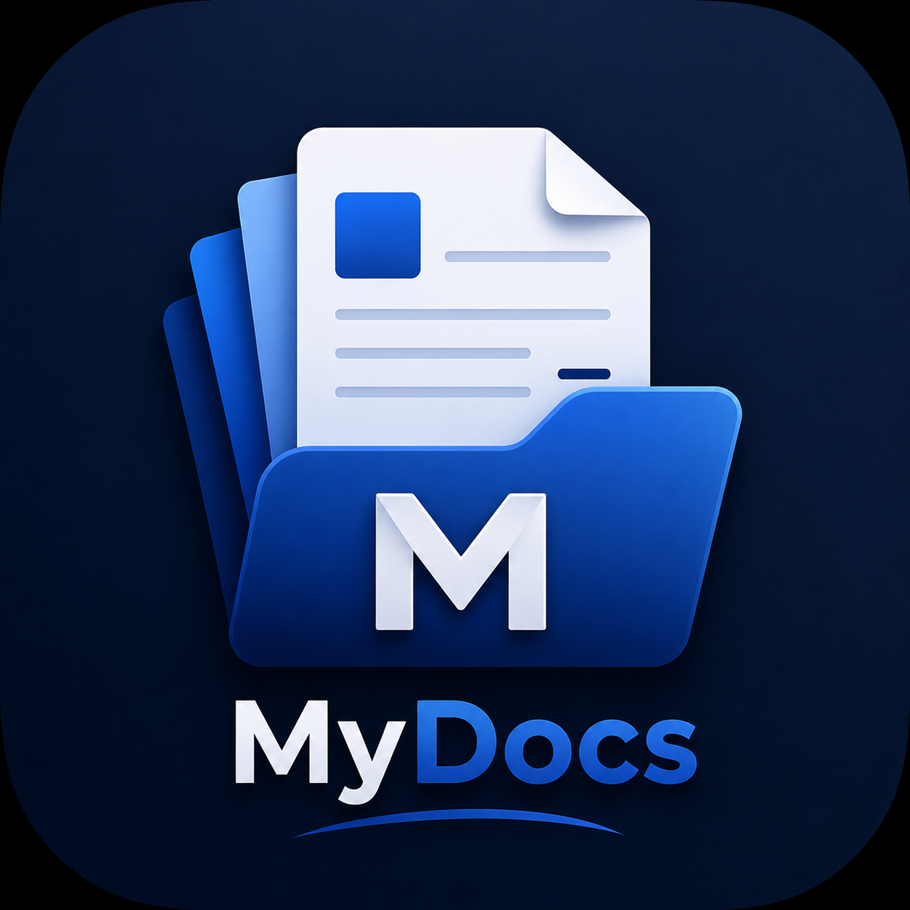

# MyDocs

MyDocs is an offline-first Flutter document manager for importing, scanning, organizing, viewing, and sharing PDFs and images.

<p align="center">
  
</p>

## About

MyDocs is built with Flutter and focuses on simple, offline-first document management. All imported documents, images, and scanned files are stored locally on the device, ensuring complete data control and privacy. Users can import existing PDF documents and images, or scan physical document pages using the device camera. The application supports dual-language localization (English and Tamil) and adapts gracefully to both phone and tablet screen dimensions.

## Features

### Document Management
- **Import PDF**: Import any PDF documents from local device storage.
- **Import Image**: Import image files (JPEG, PNG, WebP) directly.
- **Multi-File Batch Import**: Sequential picker pipeline that handles importing multiple PDF or image files concurrently in a queue to prevent memory spikes.
- **Browse Modes**: Toggle between adaptive grid card and structured list layouts.
- **Dynamic Search**: Filter documents instantly by name.
- **Auto-generated Thumbnails**: Instant PDF page previews and memory-cached image/PDF thumbnails.

### Document Scanner
- **Camera Scanning**: Scan physical document pages utilizing Google ML Kit.
- **Multi-Page Scanning**: Append multiple pages to a single scan session.
- **Reordering**: Reorder pages easily using drag-and-drop gestures with stable widget keys.
- **Page Deletion & Replacement**: Edit/replace or delete specific pages before saving.
- **Session Previews**: Fast PDF preview generation before finalizing.
- **Single-Save PDF Generation**: Consolidate scanned pages into a single PDF with a custom document name.

### Built-in Viewers
- **Offline PDF Viewer**: Read PDFs natively using interactive gesture controls.
- **Image Viewer**: High-quality photo viewer.
- **Pinch-to-Zoom**: Fluid zooming around focal points using a centered fitted base-widget layout.
- **Fit-to-Screen**: Instantly reset layout scales and offsets.

### File Actions
- **Multi-Select**: Long-press any document to enter selection mode and perform bulk actions.
- **Share**: Export and share single or multiple files simultaneously.
- **Recycle Bin (Soft Delete)**: Move files to a local Recycle Bin instead of deleting permanently.
- **Restore & Purge**: Restore documents from the Recycle Bin or delete them permanently.

### Personalization
- **System Themes**: Toggle between system-adaptive Light and Dark modes.
- **Dual Localization**: Fully localized in English and Tamil (தமிழ்).
- **Responsive Layouts**: Supports adaptive drawer interfaces for both mobile phones and tablets.

## Tech Stack

MyDocs uses the following open-source libraries:
- **Flutter & Dart SDK**
- **flutter_riverpod**: Declared state providers and selection state isolation.
- **go_router**: Declarative application routing and stacks.
- **hive & hive_flutter**: Lightweight local box storage.
- **google_mlkit_document_scanner**: Camera document capture pipeline.
- **pdf & printing**: PDF document creation and generation isolates.
- **pdfx**: Native PDF rendering controllers.
- **wakelock_plus**: Screen-on overrides during document reading.
- **share_plus**: Platform-native document sharing.
- **file_picker**: Sequential document and image file importer.

## Architecture

MyDocs is structured with feature-first modularity:

```text
lib/
├── core/
│   ├── localization/
│   ├── router/
│   ├── storage/
│   └── widgets/
└── features/
    ├── documents/
    ├── home/
    ├── folders/
    ├── recycle_bin/
    └── settings/
```

Data flows from the UI Layer through Riverpod providers into Use Cases and Repositories, saving metadata locally via Hive boxes and document files in the secure app document directory.

## Getting Started

### Prerequisites
- Flutter SDK (compatible with version `3.44.4` or later)
- Android SDK
- An Android device or emulator for testing

### Development Setup
1. Clone the repository:
   ```bash
   git clone https://github.com/Ragulchandru/MyDocs.git
   cd MyDocs
   ```
2. Fetch dependencies:
   ```bash
   flutter pub get
   ```
3. Generate localized translations:
   ```bash
   flutter gen-l10n
   ```
4. Run the code generator:
   ```bash
   dart run build_runner build --delete-conflicting-outputs
   ```
5. Launch the application:
   ```bash
   flutter run
   ```

## Screenshots

App screenshots will be added here.

## Download

The latest stable Android APK is available from the [GitHub Releases](https://github.com/Ragulchandru/MyDocs/releases) page.

## Platform Support

| Platform | Status |
| --- | --- |
| Android | Supported |
| iOS | Not tested |
| Windows | Not tested |
| Web | Not tested |

## Privacy

- All document processing, storage, and rendering are done offline and locally on the device.
- No network account creation or external server uploads are required.
- Google Play Services / Google ML Kit may execute standard runtime diagnostics locally during scanning operations.

## Project Status

MyDocs v1.0.0 — Initial stable release. Future updates will focus on maintenance, platform adjustments, and performance fixes.

## License

No license has been specified for this repository yet.
